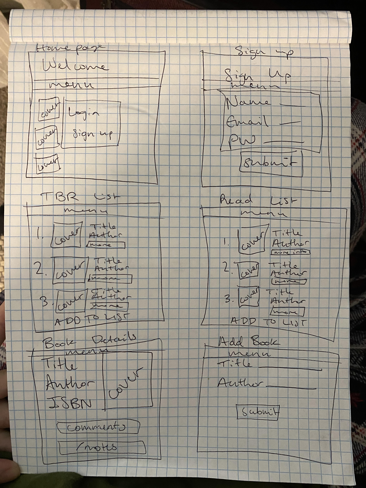

# `TBR List`

## Description:
Create a user profile and make a reading list by entering authors and books into the database or by making a selection from what's already been entered.

## ERD:


## Wireframes:


## Routes
| Method | Path | Location | Description |
| GET | / | server.js | homescreen |
| GET | /profile | server.js | profile page |
| GET | /edit | server.js | form to edit profile details |
| PUT | /edit | server.js | edit profile details and redirect to '/profile' |
| GET | /* | server.js | 404 page |
| GET | /auth/signup | auth.js | signup form |
| GET | /auth/login | auth.js | login page |
| GET | /auth/logout | auth.js | logout and redirect to '/' |
| POST | /auth/login | auth.js | redirect back to '/' if successfully logged in |
| POST | /signup | auth.js | if successful, create user in user model, redirect to logged in homepage '/' |
| POST | /authors | authors.js | create new author in author model |
| GET | /authors/new | authors.js | form to create author in author model |
| GET | /books | books.js | display all books |
| POST | /books | books.js | create new book in book model, redirect back to '/profile' |
| GET | /books/new | books.js | form to create new book in book model |
| GET | /books/:id | books.js | render details page for one book |
| POST | /tbrLists | tbrLists.js | create new tbrList on user profile and redirect back to '/profile' |
| GET | /tbrLists/new | tbrLists.js | form to create new tbrList |
| GET | /tbrLists/:id | tbrLists.js | render one tbrList |
| GET | /tbrLists/:id/add | tbrLists.js | form to add book to tbrList |
| POST | /tbrLists/:id/add | tbrLists.js | add book to tbrList through bookTbrList join table (links book.id to tbrList.id) |
| DELETE | /tbrLists/:id/remove | tbrLists.js | remove book from tbrList and redirect back to '/tbrLists/:id' |

## User Model:
| Column Name | Data Type | Description |
| id | integer | auto-generated serial primary key |
| name | string | user's name, required |
| email | string | user's email, required |
| password | string | user's password, required |
| createdAt | Date | auto-generated |
| updatedAt | Date | auto-generated |

Static Associations:
```javascript
static associate(models) {
    models.user.hasMany(models.tbrList)
}
```

## Author Model:
| Column Name | Data Type | Description |
| id | integer | auto-generated serial primary key |
| name | string | author's name, required |
| createdAt | Date | auto-generated |
| updatedAt | Date | auto-generated |

Static Associations:
```javascript
static associate(models) {
    models.author.hasMany(models.book)
}
```

## Book Model:
| Column Name | Data Type | Description |
| id | integer | auto-generated serial primary key |
| title | string | title of book, required |
| authorId | integer | author.id of author who wrote book |
| createdAt | Date | auto-generated |
| updatedAt | Date | auto-generated |

Static Associations:
```javascript
static associate(models) {
    models.book.belongsTo(models.author)
    models.book.belongsToMany(models.tbrList, { through: 'bookTbrList' })
}
```

## TbrList Model:
| Column Name | Data Type | Description |
| id | integer | auto-generated serial primary key |
| name | string | list title, required |
| userId | integer | user's id |
| createdAt | Date | auto-generated |
| updatedAt | Date | auto-generated |

Static Associations:
```javascript
static associate(models) {
    models.tbrList.belongsTo(models.user)
    models.tbrList.belongsToMany(models.book, { through: 'bookTbrList' })
}
```

## BookTbrList Model:
| Column Name | Data Type | Description |
| id | integer | auto-generated serial primary key |
| tbrListId | integer | tbrList.id for tbrList being added to |
| bookId | integer | book.id of book being added to tbrList |
| createdAt | Date | auto-generated |
| updatedAt | Date | auto-generated |

Static Associations:
```javascript
// none
```

## NPMs: 

-  [bcryptjs](https://www.npmjs.com/package/bcryptjs): A library to help you hash passwords. ( [wikipedia](https://en.wikipedia.org/wiki/Bcrypt) ) 
    - Blowfish has a 64-bit block size and a variable key length from 32 bits up to 448 bits.
- [connect-flash](https://github.com/jaredhanson/connect-flash): The flash is an area of the session used for storing messages that will be used to to display to the user. Flash is typically used with redirects.
- [passport](https://www.passportjs.org/docs/): Passport is authentication middleware for Node.js. It is designed to do one thing authenticate requests. There are over 500+ strategies used to authenticate a user; however, we will be using one - *passport-local* Passport is authentication middleware for Node. It is designed to serve a singular purpose: authenticate requests
- [passport-local](http://www.passportjs.org/packages/passport-local/): The local authentication strategy authenticates users using a username and password. The strategy requires a verify callback, which accepts these credentials and calls done providing a user. [passport-local](http://www.passportjs.org/packages/passport-local/)
- [express-session](https://github.com/expressjs/session): Create a session middleware with given *options*.
- [method-override](https://github.com/expressjs/method-override): Lets you use HTTP verbs such as PUT or DELETE in places where the client doesn't support it.

## File Structure

```text
├── config
│   └── config.json
│   └── ppConfig.js
├── controllers
│   └── auth.js
│   └── authors.js
│   └── books.js
│   └── tbrLists.js
├── middelware
│   └── isLoggedIn.js
├── migrations
│   └── ...
├── models
│   └── author.js
│   └── book.js
│   └── bookComment.js
│   └── bookTbrList.js
│   └── index.js
│   └── tbrList.js
│   └── user.js
├── node_modules
│   └── ...
├── public
│   └── assets
│   └── css
│       └── style.css
├── test
│   └── auth.test.js
│   └── index.test.js
│   └── profile.test.js
│   └── user.test.js
├── views
│   └── auth
│       └── login.ejs
│       └── signup.ejs
│   └── authors
│       └── new.ejs
│   └── books
│       └── details.ejs
│       └── index.ejs
│       └── new.ejs
│   └── partials
│       └── alerts.ejs
│   └── tbrLists
│       └── addEntry.ejs
│       └── new.ejs
│       └── show.ejs
│   └── 404.ejs
│   └── index.ejs
│   └── layout.ejs
│   └── profile.ejs
├── .gitignore
├── apiTest.js
├── dbTest.js
├── package-lock.json
├── package.json
├── README.md
├── server.js
```

## Installation Instructions:
`1` `fork` and `clone` repository
`2` navigate to folder for project and enter `npm install` in terminal
`3` enter `sequelize db:migrate` in terminal

## Future plans
Use API to pull book covers. Add comments to book details pages.