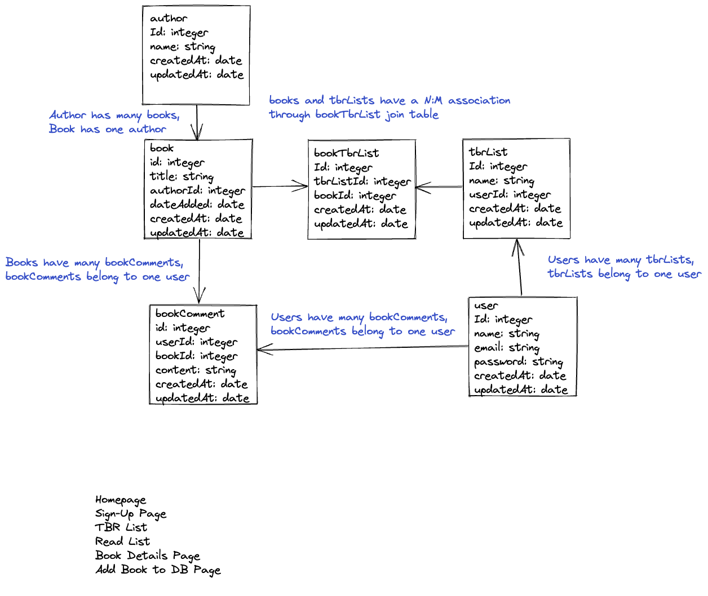

# `TBR List`

## Description:
Createa a user profile and make a reading list by entering authors and books into the database or by making a selection from what's already been entered.

## ERD:


## Wireframes:

## Routes

## NPMs: 

-  [bcryptjs](https://www.npmjs.com/package/bcryptjs): A library to help you hash passwords. ( [wikipedia](https://en.wikipedia.org/wiki/Bcrypt) ) 
    - Blowfish has a 64-bit block size and a variable key length from 32 bits up to 448 bits.
- [connect-flash](https://github.com/jaredhanson/connect-flash): The flash is an area of the session used for storing messages that will be used to to display to the user. Flash is typically used with redirects.
- [passport](https://www.passportjs.org/docs/): Passport is authentication middleware for Node.js. It is designed to do one thing authenticate requests. There are over 500+ strategies used to authenticate a user; however, we will be using one - *passport-local* Passport is authentication middleware for Node. It is designed to serve a singular purpose: authenticate requests
- [passport-local](http://www.passportjs.org/packages/passport-local/): The local authentication strategy authenticates users using a username and password. The strategy requires a verify callback, which accepts these credentials and calls done providing a user. [passport-local](http://www.passportjs.org/packages/passport-local/)
- [express-session](https://github.com/expressjs/session): Create a session middleware with given *options*.
- [method-override](https://github.com/expressjs/method-override): Lets you use HTTP verbs such as PUT or DELETE in places where the client doesn't support it.

## File Structure

```text
├── config
│   └── config.json
│   └── ppConfig.js
├── controllers
│   └── auth.js
│   └── authors.js
│   └── books.js
│   └── tbrLists.js
├── middelware
│   └── isLoggedIn.js
├── migrations
│   └── ...
├── models
│   └── author.js
│   └── book.js
│   └── bookComment.js
│   └── bookTbrList.js
│   └── index.js
│   └── tbrList.js
│   └── user.js
├── node_modules
│   └── ...
├── public
│   └── assets
│   └── css
│       └── style.css
├── test
│   └── auth.test.js
│   └── index.test.js
│   └── profile.test.js
│   └── user.test.js
├── views
│   └── auth
│       └── login.ejs
│       └── signup.ejs
│   └── authors
│       └── new.ejs
│   └── books
│       └── details.ejs
│       └── index.ejs
│       └── new.ejs
│   └── partials
│       └── alerts.ejs
│   └── tbrLists
│       └── addEntry.ejs
│       └── new.ejs
│       └── show.ejs
│   └── 404.ejs
│   └── index.ejs
│   └── layout.ejs
│   └── profile.ejs
├── .gitignore
├── apiTest.js
├── dbTest.js
├── package-lock.json
├── package.json
├── README.md
├── server.js
```

